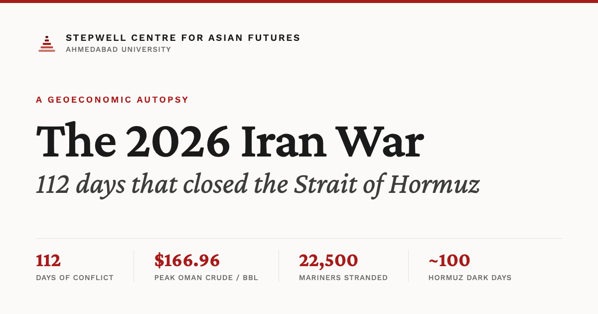

# The 2026 Iran War: A Geoeconomic Autopsy

> 112 days of conflict, a closed Strait of Hormuz, and 22,500 stranded mariners —
> a long-form data-journalism autopsy of the 2026 Iran War's geoeconomic
> consequences, from the [Stepwell Centre for Asian Futures](https://ahduni.edu.in/academics/schools-centres/stepwell-centre-for-asian-futures/),
> Ahmedabad University.

**Live:** https://fritzhand.github.io/iranwar/



---

## About

A single-page, long-form editorial piece that reconstructs the 2026 Iran War as
an economic event: what a closed Strait of Hormuz does to oil and LNG prices,
shipping, insurance, remittances, and the Indian rupee. It pairs a narrated
scrollytelling map of the conflict timeline with cited charts and a source
audit, in the spirit of a *document of record* rather than a dashboard.

This repository is a fork of [`chromadharma/iranwar`](https://github.com/chromadharma/iranwar).
The `editorial-redesign` branch overhauls the original dark "data terminal"
theme into a light, New York Times–style editorial system. See
[`CHANGELOG.md`](CHANGELOG.md) for the full approach and change history and
[`DESIGN.md`](DESIGN.md) for the design system.

## Features

- **Scrollytelling conflict map** — a sticky Leaflet map that flies between
  events as the reader scrolls the 15-step timeline, with a synced overlay.
- **Clickable phase legend** — jump to any escalation phase (Outbreak →
  Recovery); the map and reading position stay in sync.
- **Floating assist navigation** — up/down controls that walk the timeline
  step-by-step on both desktop and mobile.
- **Light / dark ("night mode")** — a full theme toggle that re-themes the
  charts and map tiles, with the choice remembered and applied before first
  paint.
- **Cited data throughout** — Chart.js and D3 (Sankey) visualizations with a
  source-audit apparatus (institution, URL, verification status).
- **Responsive + accessible** — stacked mobile layout, `prefers-reduced-motion`
  honored, keyboard-operable navigation.

## Tech stack

Static site, no build step. Vendored via CDN:

- [Leaflet](https://leafletjs.com/) — the scrollytelling and sandbox maps (CARTO Positron / Dark Matter tiles)
- [Chart.js](https://www.chartjs.org/) (+ annotation plugin) — time-series and bar charts
- [D3](https://d3js.org/) + [d3-sankey](https://github.com/d3/d3-sankey) — flow diagrams
- [Crimson Pro](https://fonts.google.com/specimen/Crimson+Pro) + [Work Sans](https://fonts.google.com/specimen/Work+Sans) — display + body/UI type

## Project structure

```
index.html        Markup, <head> meta (OG/Twitter), and page sections
css/styles.css    Design system: tokens, layout, light/dark themes, responsive
js/data.js        All content + data (timeline, chart series, sources, palette)
js/app.js         Rendering, maps, charts, scrollytelling, theme + nav logic
assets/           Portraits, favicon (stepwell mark), and social OG image
DESIGN.md         Design system — single source of truth for visual decisions
CHANGELOG.md      Redesign approach and change history
```

## Local development

No dependencies to install — serve the directory over HTTP so the fonts, maps,
and modules load correctly:

```bash
python3 -m http.server 8000
# then open http://127.0.0.1:8000
```

Editing `js/data.js` changes the content; `css/styles.css` and `DESIGN.md`
govern the look. Read `DESIGN.md` before making visual changes.

## Deployment

Published with **GitHub Pages** from the `editorial-redesign` branch root, live
at https://fritzhand.github.io/iranwar/. All asset paths are relative, so the
site works unchanged under the `/iranwar/` project subpath.

## Credits

- **Research & analysis / original author:** Sahasrik Ragani, Ahmedabad
  University ([original repository](https://github.com/chromadharma/iranwar) ·
  [LinkedIn](https://www.linkedin.com/in/rudraveeraragani/))
- **Fork & editorial redesign:** Jeremy Fritzhand
  ([GitHub](https://github.com/fritzhand) ·
  [LinkedIn](https://www.linkedin.com/in/fritzhand/)), developed with gstack
  (Claude Code) as design partner
- **Faculty mentor:** Sudeep Chakravarti
- **Publisher:** Stepwell Centre for Asian Futures, Ahmedabad University

## Data & sources

Figures are drawn from open institutional sources (EIA/FRED, RBI, IMO, IEA, WTO,
IMF PortWatch, S&P Global, Lloyd's, Reuters, and others) and carry an in-page
source audit with verification status. Some conflict-period values are marked
pending or unverified where they require terminal access or forthcoming
publication — read them with the cited caution. This is an analytical
reconstruction for research and educational use.
